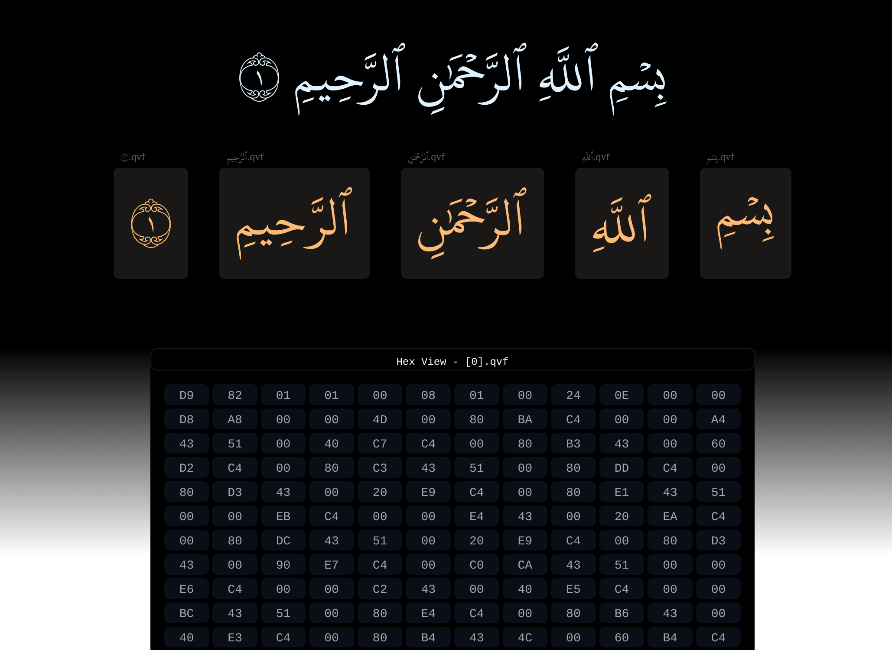

# Quran File Format
Proposal for a standard file format for Quran content allowing for storing, retrieval of Quran textual content in a more efficient and indexable structure.

- 📈 46% smaller than the regular textual format
- 🗜️ Gzipped version is 75% smaller
- 💿 Web decoder available, More to come soon inshaa Allah.


**I. Introduction**

* [Overview of the Quran file format](#overview)
* [Target audience and intended use](#audience)
* [Version information and release history](#version)

**II. File Structure**

* [Overall layout of the file](#layout)
    * [Signature Section](#signature)
    * [Version Section](#version)
    * [Charset Section](#charset)
    * [Wordset Section](#wordset)
    * [Content Section](#content)

**IV. How To Use**

* [Npm Package](#npm)
* [Quran Visual Format](#qvf)

**V. Contribution**

* [Contribution Guide](#contribution)

**VI. Appendices**

* [Credit](#credit)

---

## **I. Introduction**
<a id="overview"></a>

#### Overview of the 'qur' file format
Ideally files ending with the .qur extension should be recognized as a Quran file format file, Therefore it should follow a specific file structure explained in section [II. File Structure](#layout). The file format is optimized for minimal file size and for fast transfer over the network using efficient techniques for reducing file size and by enabling progressive loading of Quran content.

<a id="audience"></a>
#### Target audience and intended use
This file format is intended for software developers involved in building applications that require lookup and retrieval of Quran textual content and for anyone looking for an alternative for the classic text format.

<a id="version"></a>
#### Version information and release history
Quran File Format version 1.0 can be downloaded from [here](https://github.com/solomancode/qur-specs/releases/tag/v1.0)

## **II. File Structure**

<a id="layout"></a>
#### Overall layout of the file
The current file structure consists of 5 sections:
| Section       | Type | Description |
| :---         |     :---:      |          :--- |
| Signature   | u8     | Quran File Format Signature — `217` `130` `00` |
| Version     | u8       | File Format Version Identification      |
| Charset     | [u8, ..u16] | A set of Quran characters encoded in 2 bytes each |
| Wordset     | [u32, ..u8] | A set of Quran words refs. to charset |
| Content     | [u8, ..u32] | An ordered sequence of refs. to wordset data |

---

<a id="signature"></a>
#### Signature Section
Quran file format Signature aka. magic mumbers identified by the sequence `217` `130` `00`

---
<a id="version"></a>
#### Version Section
Quran file format version identification number, A single unsigned integer byte

---
<a id="charset"></a>
#### Charset Section
A set of unique non-repeating Quran content characters encoded in two bytes each, following a single unsigned integer byte of their count.

---
<a id="wordset"></a>
#### Wordset Section
A set of unique non-repeating Quran content words, each word is represented in two parts: A single unsigned integer byte of words chars count and a sequence of chars represented as a reference number to the charset data. The first 4 bytes of the wordset section is encoded as a u32 integer representing total words count.

---
<a id="content"></a>
#### Content Section
An ordered sequence of ayahs, each ayah consists of a u8 integer representing ayah words count followed by a sequence of refs. to wordset data. The first 4 bytes of the content section is encoded as a u32 integer representing total ayahs count.

---

## **IV. How To Use**

<a id="npm"></a>
#### Npm Package
An npm package is available [here](https://www.npmjs.com/package/@quran-file-format/decoder)

```sh
npm install @quran-file-format/decoder --save
```

*usage example*

```js
import { QuranFileFormat } from '@quran-file-format/decoder';

const response = await fetch('uthmani.qur');
const buffer = await response.arrayBuffer();

const qur = new QuranFileFormat(buffer);
const suraAlFatiha = qur.sura(1);

if (suraAlFatiha.status === 'success') {
    const { value } = suraAlFatiha;
    const content = value.toString();
    console.log(content);
}
```

<a id="qvf"></a>
# Quran Visual Format

| Section       | Type | Description |
| :---         |     :---:      |          :--- |
| Signature   | u8     | Quran Visual Format Signature — `217` `130` `01` |
| Format     | u8       | Format: SVG: 01 |
| UPM     | u16 | Units Per Em |
| Glyphs Count     | u16 | Glyphs Count |
| Glyph Data     | [u32, u32, u8, f32*] | [Section Size, Txt, Draw Command Kind, Points] |


<a id="contribution"></a>
## **V. Contribution**
Contributions are welcome, Please feel free to open a PR. with your contribution, suggestions and bug fixes.
- **Nice To Have Contributions:**

    - A decoder implementation in any of the following languages: Dart, Swift, Kotlin ...
    - New ideas and improvement suggestions

<a id="credit"></a>
## **VI. Appendices**
#### Credit
The original Quran content was downloaded from [https://tanzil.net/download/](https://tanzil.net/download/)
